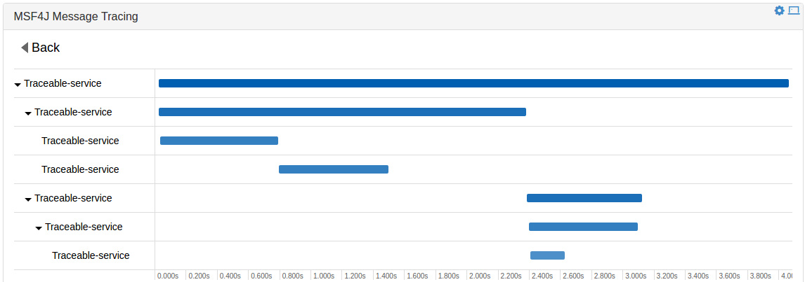
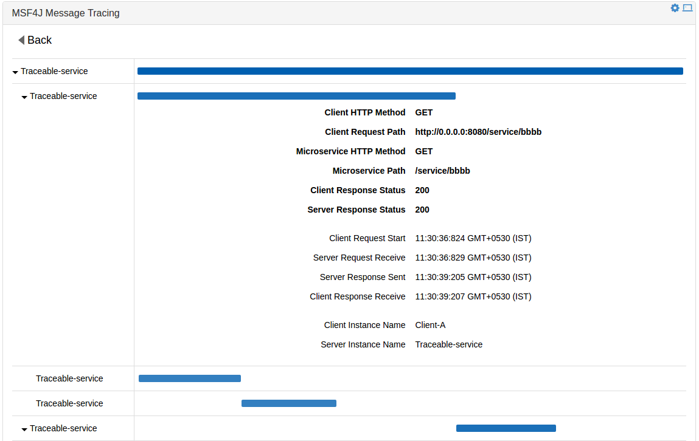

# MSF4J WSO2 DAS Distributed Message Tracing Sample

This is the MSF4J sample that demonstrates distributed service tracing using WSO2 DAS.

## Points to note in the code

Add the msf4j tracing dependency to the pom of you MSF4J service.
```xml
    <dependencies>
        <dependency>
            <groupId>org.wso2.msf4j</groupId>
            <artifactId>msf4j-analytics</artifactId>
        </dependency>
    </dependencies>
```

Register the tracing interceptor when starting the microservice.
```java
    new MicroservicesRunner()
                .addInterceptor(new MSF4JTracingInterceptor("Traceable-service"))
                .deploy(new TraceableService())
                .start();
```

Register the tracing filter in the client instances.
```java
    Client client = ClientBuilder.newClient()
                .register(new MSF4JClientTracingFilter("Client-A"));
```


## How to build the sample

From this directory, run

```
mvn clean install
```

## How to run the sample

Download [WSO2 DAS Version 3.0.1](http://wso2.com/products/data-analytics-server/) and start it with default configurations.

Build [wso2das-tracing-capp](../../analytics/wso2das-tracing-capp) module and get the wso2das-msf4j-tracing-*.car file. 
Then, [deploy wso2das-msf4j-tracing-*.car file](https://docs.wso2.com/display/DAS301/Packaging+Artifacts+as+a+C-App+Archive#PackagingArtifactsasaC-AppArchive-DeployingacAppDeployingaC-App) 
in the WSO2 DAS instance you just started. Now you can check the MSF4J Message Tracing Dashboard at 
[https://localhost:9443/portal/dashboards/msf4j-message-tracing](https://localhost:9443/portal/dashboards/msf4j-message-tracing).

After that, from the target directory of this sample, run the following command to start the sample microservice.
```
java -jar msf4j-wso2das-tracing-*.jar
```

## How to test the sample

We will use the cURL command line tool for testing. You can use your preferred HTTP or REST client too.

```
curl http://localhost:8080/service/aaaa
```

You should get a response similar to the following:

```
aaaa-res:bbbb-res:dddd:eeee:cccc-res:ffff-res:gggg
```

The above response was generated by 'service/aaaa' by calling several other microservice endpoints in different service call depths.
So after receiving the above response, you can go to the WSO2 DAS dashboard and find the traces.







